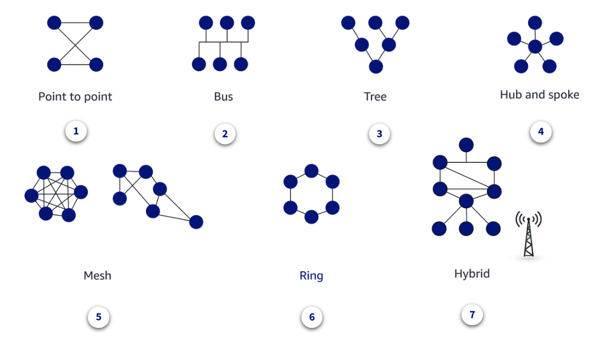
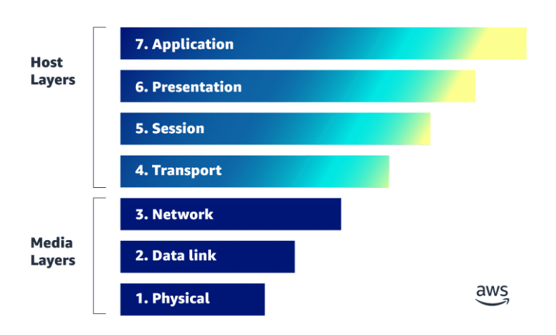

#### IAM - Basico
autorização = o que esse usuario pode fazer/acessar?

autenticação = quem é essa pessoa

Porque usar IAM?
- Utilização do MFA
- permissões granulares
- Permite acesso compartilhado à aws
- Permite acesso seguro entre aplicações dentro da aws
- Federação de identidades

Quando não pode usar o IAM:
- Chaves SSH de uma EC2
- Certificados RDP Windows

AWS contém 2 tipos de endpoint acessíveis ao usuário:
- Console - acessado com usuario e senha
- API de consulta - access_key e secret_access_key

#### AWS Security, Identity, and Compliance

A segurança é a prática de proteger sua propriedade intelectual contra acesso, uso ou modificação não autorizados. 

Tríade -> CIA – confidencialidade, integridade e disponibilidade

- confidentiality - limitação de acesso e divulgação a usuários autorizados e impedir acesso de pessoas não autorizadas
- integrity - preservação do que foi transmitido o inserido no sistema
- availability - prontidão de recursos
    

##### AWS Well-Architected Framework
1. Excelência operacional - execução e monitoramento de sistemas para entregar valor, melhoria de processos e procedimentos
2. Segurança - proteção de informações e do sistema
3. Confiabilidade - capacidade de evitar e se recuperar de falhas
4. Eficiência de performance - uso eficiente dos recursos de TI
5. Otimização de custos - evita gastos desnecessários

Serviços da AWS utilizados para Identity and access management:
- Amazon cognito
- AWS Directory Service
- IAM
- Single sign on 

#### Controles de detecção
Serviços AWS para controle de detecção:
- AWS Security Hub
- Amazon Guard Duty
- Amazon Inspector
- Amazon detective
- Amazon macie

#### Network

Network services by group:

- Network foundations
* Amazon VPC - provides private location to launch AWS resources, in a isolated network
* AWS Transit Gateway - manage and simplify connections and peering between VPCs
* AWS Private Link - establish secure and private connectivity between VPC, AWS services in the same region
or inside another VPC and on premisses infra

- Hybrid connectivity 
* AWS Direct connect - connect data center with aws
* AWS Cloud WAN - connect cloud routing and SD-WANs 
* AWS Client VPN - connect remote team access
* AWS site-to-site VPN - connect remote offices

- Edge Networking
Fazem face com o user final
* Amazon cloudfront - entrega dados, vídeos, aplicações e APIs com latência reduzida
* Amazon Route 53 - DNS da amazon
* AWS Global Accelerator - otimiza trafego,do usuario à aplicação

- Application Networking:
Provem às aplicações melhores segurança, disponibilidade, performance e monitoração eficiente
* Amazon API Gateway - cria e mantem APIs
* AWS App mesh - conecta containers e microserviços com o nível da aplicação
* AWS Cloud Map - discovery dos recursos e serviços recentes

- Network security
* AWS Firewall manager - centraliza e mantem as regras de firewall
* AWS Shield - Adiciona segurança as apliações contra ataques
* AWS network Firewall - Aplica seguurança de rede a VPC
* AWS WAF - Protege aplicações web contra ataques conhecidos

#### Conceitos de redes

##### Networkd design patterns 

1. Conexão privada de dados, que conectam 2 ou mais localidades. É um tipo de rede fechada e não faz face com a internet pública.

2. Redes conectadas por um único cabo

3. Usado para compartilhar informação entre vários servidores, o sinal transmitido atraves do node root é recebido por todos computadores, ao mesmo tempo.

4. Hub de rede no centro e os "spokes" são os aparelhos conectados por fora, todos aparelhos se conectam com o centro.
Na aws esse tipo de design é utilizado usando VPN Connections, Direct Connect, Direct Connect Gateways, VPC Peering e Transit Gateways.

5. Vários links no mesmo lugar. Mash contém conexões parcialmente e completamente desenhadas. Esse tipo de topologia adiciona redundancia devido às multiplas conexões. 
Bom uso: Network load balancing
Normalmente utilizada em wide area networks (WANs)
Essa topologia é construida usando transit gateway ou vpc peering.

6. Mais utilizado em metro area networks (MANs).
Se uma conexão for cortada, então o "ring" não poderá enviar informações pelo "ring". O dado vai o mais longe possível e então volta atras. 

7. Hibrido - misturar várias topologias.

##### Protocolos
Protocolos de rede ajudam a trazer diferentes funcionalidades pra o design da rede para otimizar performance, securança e visibilidade.

* Network managements protocol
Define as policies e os procedimentos para monitorar, gerenciar e manter a rede.
Ele garante comunicação estável e ótima performance.
Ajudam a realizar troubleshooting das conexões entre host e client
Provẽ status de conexão, disponibilidade, perda de pacote ou de dados...
 
* SNMP
* ICMP

* Network communication protocol
Determina o formato e as regras que serão usadas para trasferir dados pela rede.
Se aplica pra ambos hardware e software

* HTTP
* TCP
* UDP
* IRC

* Network security protocol
Garente que o tráfego de dados entre a rede está seguro.
Protege de usuários não autorizados, serviços ou aparelhos.
Dependem de criptografia para manter os dados seguros.

* SSL
* SFTP
* HTTPS

##### Protocolos comuns na AWS
- IPv4
Números de 32bits, num range de 0 a 255 separados por "."
Inicia com 0.0.0.0 até 255.255.255.255

- IPv6
Números de 128bits
A principal diferença entre os dois é que o IPv6 provê um grande espaço de endereços e tem um header simplificado em comparação ao IPv4

- CIDR
CIDR provê uma representação numérica de uma rede que descreve suas caracteristicas e mask length que determina os endereços utilizáveis incluindo o endereço de inicio e fim

- Subnetting
É o processo de dividira rede em menores seções de rede.
Subnet é uma organização logica de aparelhos conectados.
São eficientes pois diminuem o o tempo de "viagem" passando por roteadores desnecessários para chegar ao destino.

- Subnet mask
É usado dentro de uma rede para determinar se um host está na subnet local ou remota.

##### Accessing data
* Network arrached storage (NAS) - se conecta com um armazenamento compartilhado entre toda a rede, normalmente armazenado num data-center e da acessos a nível de arquivo.

Na AWS poderia ser utilizado Elastic File System (EFS) ou Amazon FSx.

* Storage area network (SAN) - adiciona nível de acesso em bloco, na AWS utilizaria o Elastic Block Store (EBS).

#### AWS Implementation
Local network ->
Open systm interconnect (OSI) model
7 camadas >
1. Física
2. Data link
3. Network
4. Transporte
5. Sessão
6. Presentations
7. Aplicação

OSI pode ser agrupado em 
> Host layers
Vai da layer 4 a 7, essa é onde seu dado é "quebrado" para transporte e "montado" no destino.SS

> Media layers
Vai da layer 1 a 3, define como o dado se move entre o ponto A e o ponto B, o ponto A pode ser sua rede local e o ponto B também ou B poderia ser na internet.

